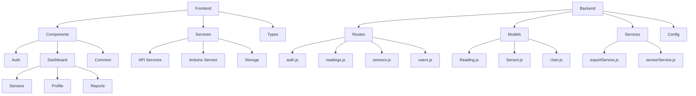
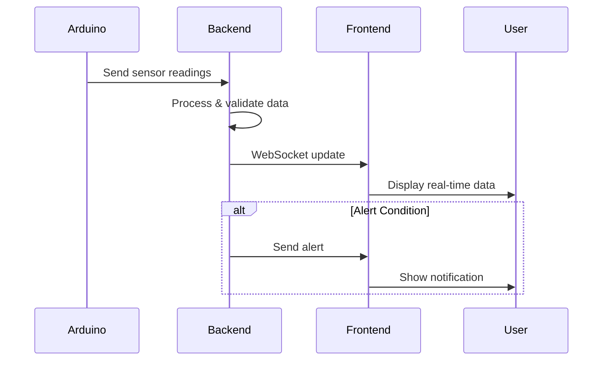
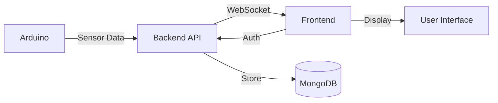

# Water Quality Monitoring System - Program Structure

## Sensor Data Flow

## System Architecture

## Key Components
1. **Arduino Hardware**
   - TDS Sensor
   - pH Sensor
   - Turbidity Sensor
   - Flow Rate Sensor

2. **Backend Server**
   - Express.js API
   - MongoDB Database
   - WebSocket Server
   - Data Processing

3. **Frontend Application**
   - React Dashboard
   - Real-time Updates
   - Data Visualization
   - User Management

## Data Flow
1. Sensors collect water quality data
2. Arduino sends data to backend
3. Backend processes and stores data
4. Frontend receives updates via WebSocket
5. UI displays real-time information
6. Alerts triggered for abnormal readings

## Security Features
- JWT Authentication
- Role-based Access Control
- Secure WebSocket Connection
- Data Validation
- Error Handling